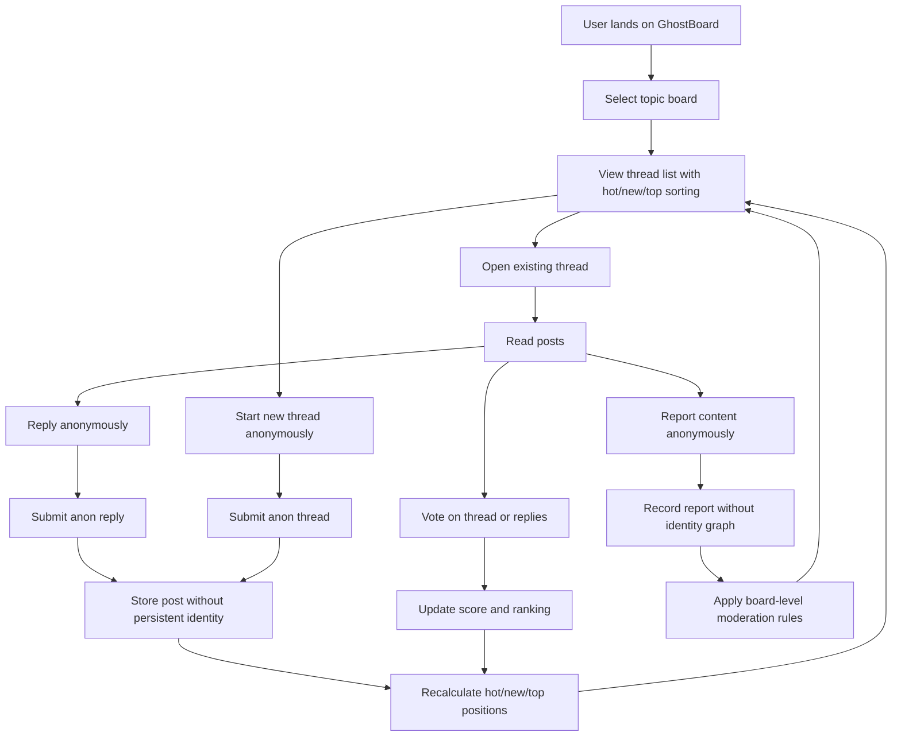

# GhostBoard – Thread Creation, Voting & Moderation Flow

Flow diagram for anonymous thread creation, voting, and moderation in GhostBoard.

```mermaid
flowchart TD
  A[User lands on GhostBoard] --> B[Select topic board]
  B --> C[View thread list with hot/new/top sorting]
  C --> D[Open existing thread]
  C --> E[Start new thread anonymously]

  D --> F[Read posts]
  F --> G[Reply anonymously]
  F --> H[Vote on thread or replies]
  G --> I[Submit anon reply]
  E --> J[Submit anon thread]

  I --> K[Store post without persistent identity]
  J --> K
  H --> L[Update score and ranking]
  K --> M[Recalculate hot/new/top positions]
  L --> M
  M --> C

  F --> N[Report content anonymously]
  N --> O[Record report without identity graph]
  O --> P[Apply board-level moderation rules]
  P --> C
```
